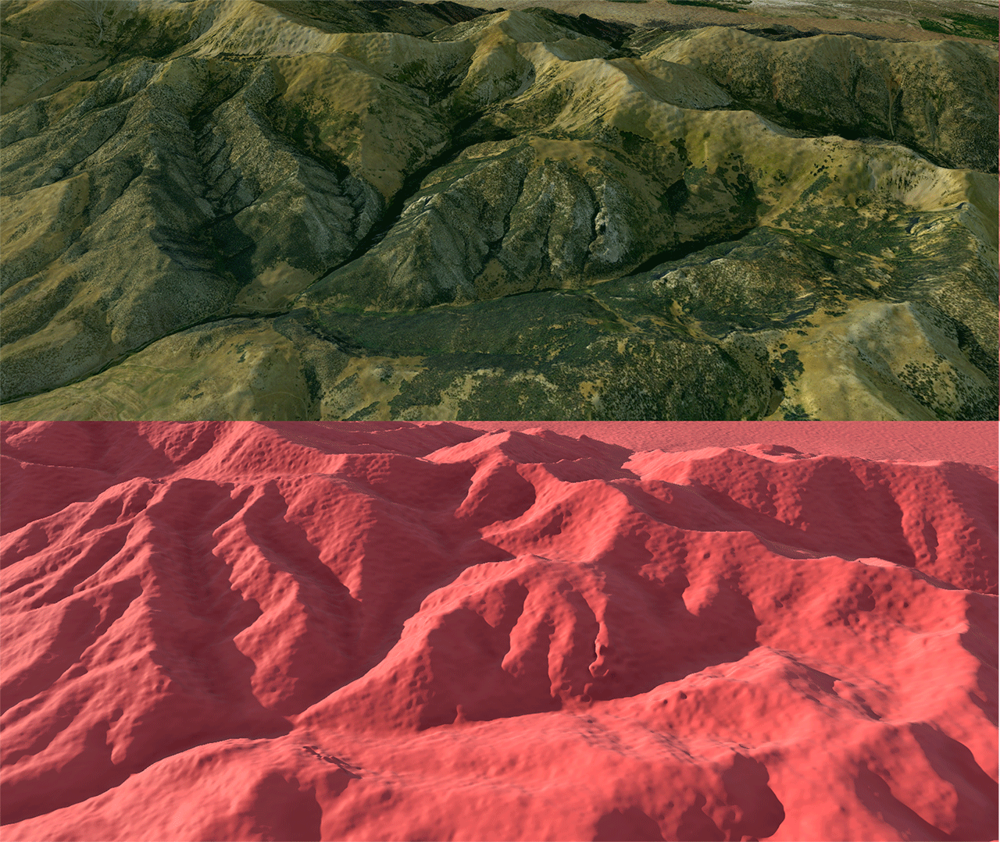
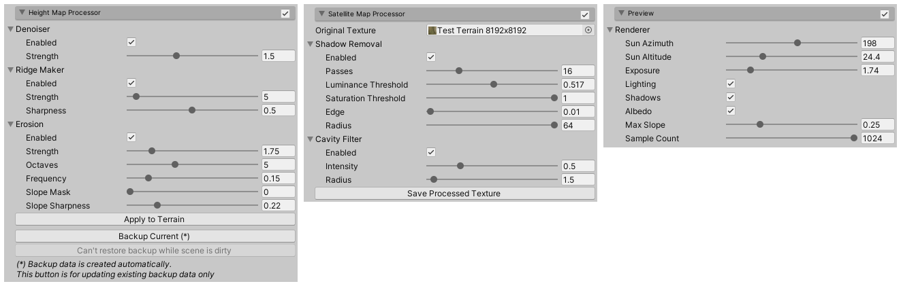

# Terrain Prettifier

## What is this?
Terrain Prettifier is a small component designed to clean and improve satellite/DEM based terrains directly inside of Unity. I started working on it because I was frustrated with how cumbersome the process of working with multiple terrain tiles in external programs was, where often I just wanted to add some higher resolution detail to an already existing height map.
It can also be used to upscale and add detail to low-resolution terrain height maps.

It is entirely GPU based and so runs at interactive framerates. Additionally, it uses a ray-marched preview renderer which allows you to instantly see the results of your settings and only applies the modifications to the actual terrain height map once you are happy with the results.

# Height map filtering
## Denoiser

Applies a bilateral blur filter to the heightmap before further processing. Useful for filtering noisy input data without destroying important features.

## Ridge Maker

Sharpens ridges. Useful if your DEM data is overly smooth. Also useful for upscaling low-resolution data.

## Erosion

Adds hydraulic erosion-like features to slopes. It should be noted this is not an actual hydraulic simulation, but rather uses a gradient-aligned noise algorithm which looks like erosion. Very useful for adding detail to slopes, and in particular for upscaling low-resolution data.

# Satellite map filtering
## Shadow Removal

Identifies shadows based on pixel luminosity and replaces them with adjacent features.

## Cavity Filter

Burns cavity (concave/convex) features into the color map. Should be used with care since it easily makes the resulting color map look like crap.

# Usage
Drop the Assets/TerrainPrettifier directory into your Assets folder to install. To apply to a terrain, add the TerrainPrettifier component.  
Once you are happy with the results, press "Apply to Terrain" and "Save Processed Texture" respectively.  
It is an editor-only script and can not be used at runtime.

# Limitations
Does not take neighbouring terrain tiles into account. This is a planned feature but I can't promise it will be added anytime soon.

# Acknowledgements & further reading
Bilateral filter by mrharicot: https://www.shadertoy.com/view/4dfGDH  
Erosion noise by clayjohn: https://www.shadertoy.com/view/MtGcWh  
Ray-marching terrain by Inigo Quilez: https://www.iquilezles.org/www/articles/terrainmarching/terrainmarching.htm
